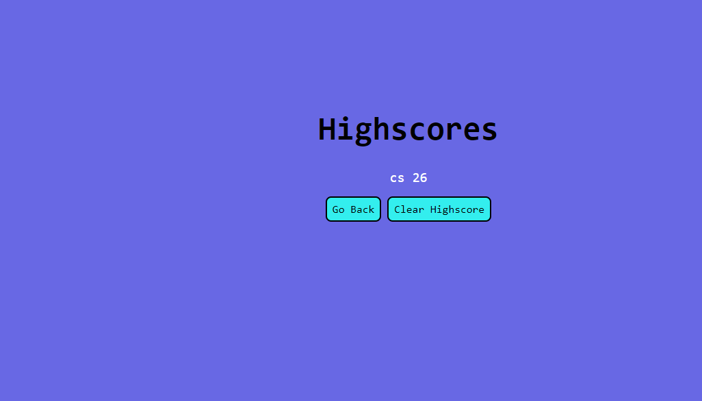

# Quiz Challange called Master Trivia Quiz
### Module 4 Web APIs Challenge: Code Quiz

> Using the lessons I learn from class I was able to create a quiz game with javascript, HTML and CSS. My quiz game has a total of 6 multiple choice questions with 60 seconds to answer before the time runs out.


## Direction 

Clone the respository:

```sh
git clone git@github.com:DecodePlaymaker/masterTrivia.git
```
1. Open Git Bash

2. Change the current working directory to the location 

3. Type git clone and paste the url

4. Finally press Enter to create a local clone


## Quiz Trivia Usage

* After reading the description and clicking start quiz, a timer will appear at the top along with the question and multiple choice answer
 


* After clicking one of the multiple choice answer, a message will appear at the bottom with correct or incorrect. If correct a button with the words Next Question to continue.


* Once you answer all the question enter full name and click submit.


* The submit button will take you too the highscores link.


## Deployed Application
* Live URL: https://decodeplaymaker.github.io/masterTrivia/

## Resource
use webpages like mdn web docs to help me better under stand javascript.
https://developer.mozilla.org/en-US/docs/Web/API/EventTarget/addEventListener